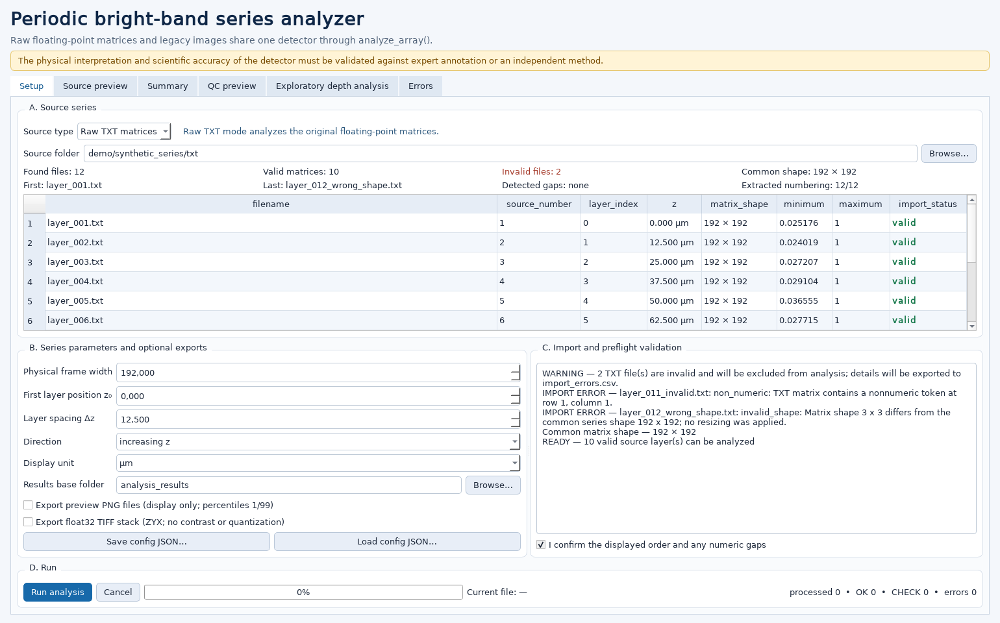
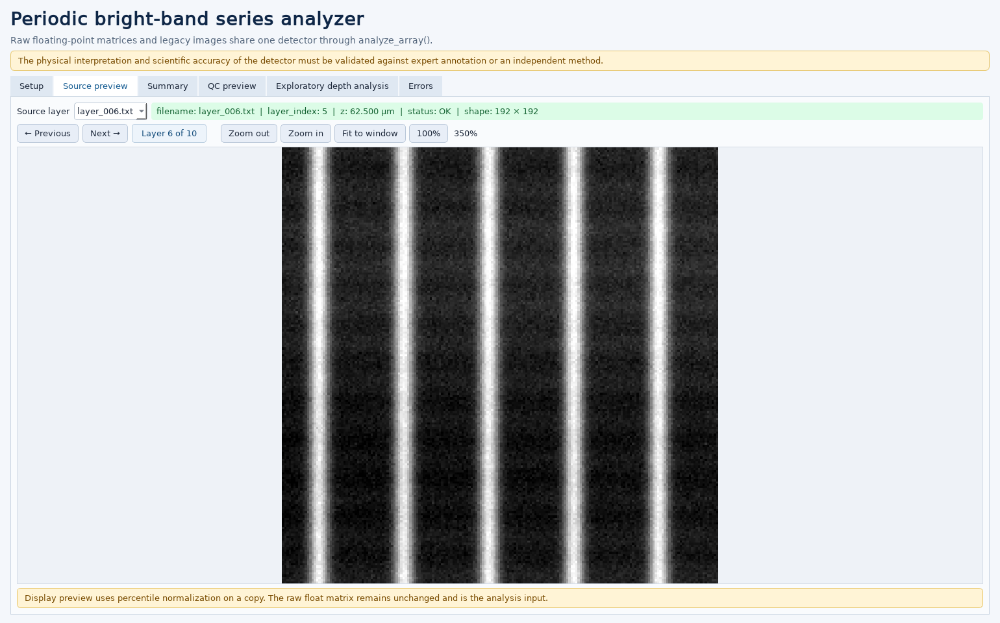
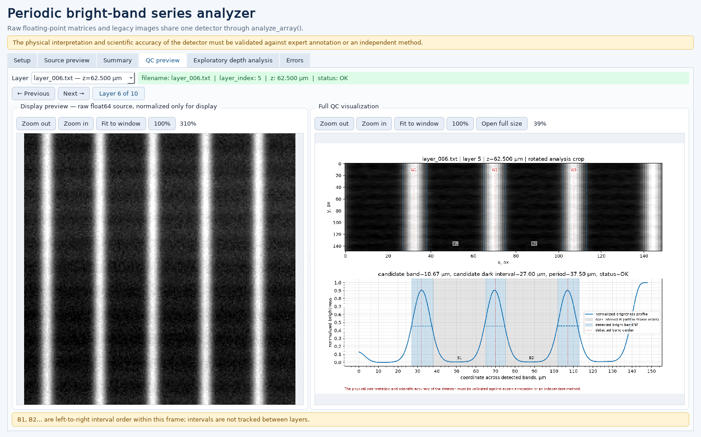
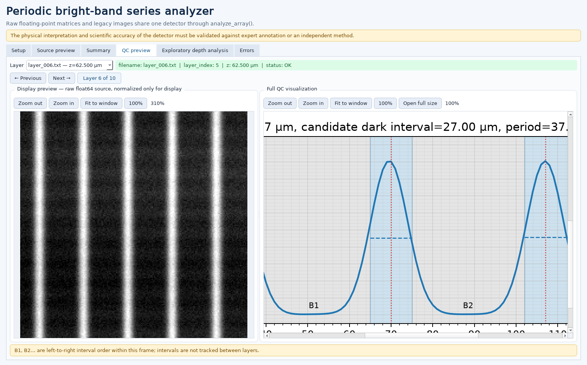
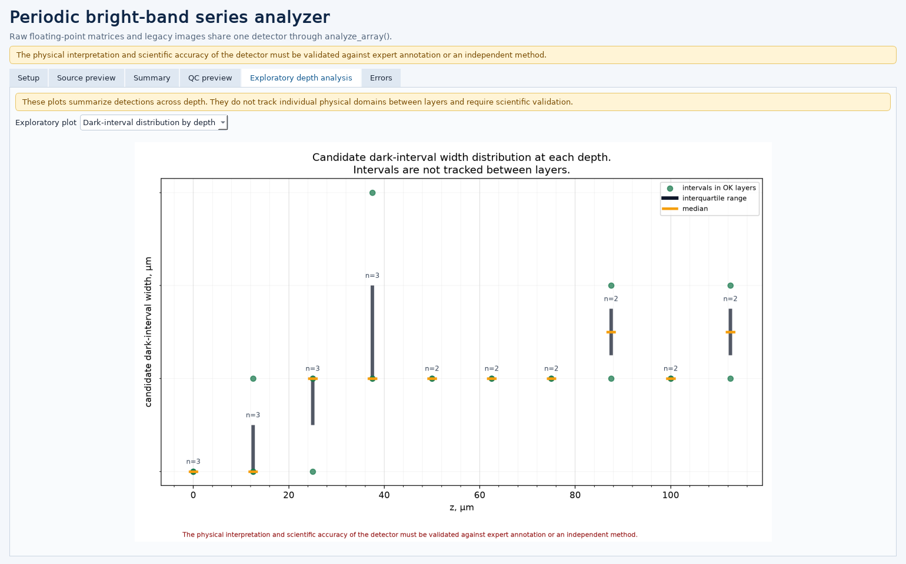

# SHG Bright-Band Series Analyzer

A desktop Python application for importing floating-point TXT image series, assigning physical depth coordinates, detecting periodic bright bands, reviewing quality-control visualizations, and exporting reproducible measurements.

> **Scientific warning**
>
> The physical interpretation and scientific accuracy of the detector must be validated against expert annotation or an independent method.

## 1. Overview

The application imports an ordered series of two-dimensional numeric matrices, maps each filename to an explicit `layer_index` and depth coordinate `z`, runs one shared detector, and provides per-layer quality-control views and structured exports. Raw TXT matrices are the primary input. A legacy PNG/TIFF mode remains available for compatibility.

This repository is a technical portfolio release. Every included matrix, image, expected value, and screenshot is synthetic.

## 2. Portfolio case study

The original workflow depended on manual preparation of image files before measurement. This application moves source validation, ordering, coordinate assignment, analysis, quality control, and export into one reproducible desktop workflow.

The portfolio version demonstrates how the workflow was redesigned:

- numeric TXT matrices are imported directly as floating-point arrays;
- the user specifies the physical frame width, first depth, and spacing between layers;
- preflight creates an explicit `filename → layer_index → z` table;
- invalid, ragged, non-finite, or wrong-shape matrices are isolated and reported;
- display previews are separate normalized copies and are never used as detector input;
- an optional float TIFF stack is exported without contrast enhancement or 8-bit quantization;
- the GUI provides source/QC review, an error report, and exploratory depth summaries;
- synthetic regression tests verify software behavior and reproducibility.

## 3. Problem solved

Series analysis is difficult to audit when file order, depth mapping, display conversion, measurement, and export are separate manual steps. The application makes those decisions explicit, validates them before processing, and records enough provenance to reproduce a run.

It does not claim that detected bright bands are proven physical domain walls or that separate physical domains are followed between layers.

## 4. Main workflow

1. Select Raw TXT matrices or legacy images.
2. Review natural filename ordering and import errors.
3. Set frame width, first depth, layer spacing, and direction.
4. Confirm any numbering gaps.
5. Run the detector in a background worker.
6. Review summary rows, source previews, QC plots, and exploratory depth plots.
7. Export CSV tables, configuration, manifest, QC PNG files, and optional display/TIFF conversions.

## 5. Key features

- strict rectangular TXT import to NumPy `float64`;
- explicit filename, source number, `layer_index`, and `z` mapping;
- synchronized Previous/Next and keyboard navigation across preview tabs;
- 10–800% zoom, pan, Fit to window, 100%, and full-size QC window;
- per-frame QC image plus normalized transverse profile;
- OK/CHECK status shown with distinct visual treatment;
- aggregate depth summary that breaks lines at CHECK layers;
- per-depth dark-interval distribution with every observation, median, IQR, and `n`;
- unique run directories and source-hash verification;
- optional `float32` TIFF stack with `ZYX` axes;
- background execution, cancellation between layers, and isolated error reporting.

## 6. Screenshots

All screenshots below use the deterministic synthetic demo.

### Series setup and explicit depth mapping



### Floating-point source preview



### Source and QC preview



### QC detail view



### Candidate dark-interval distribution by depth



Intervals are independent observations at each depth and are not followed as physical identities between layers.

## 7. Installation

Python 3.10 or newer is required.

```powershell
python -m venv .venv
.\.venv\Scripts\Activate.ps1
python -m pip install --upgrade pip
python -m pip install -e ".[test]"
```

Dependencies are declared in `pyproject.toml`: NumPy, Pillow, SciPy, Matplotlib, PySide6, tifffile, and pytest for tests.

## 8. Running the GUI

```powershell
python run_gui.py
```

After installation, the console entry point is also available:

```powershell
shg-series-analyzer
```

Application startup never installs packages.

## 9. Synthetic demo

The repository contains a deterministic synthetic series with ten valid layers and two intentional negative TXT examples. The data generator uses a fixed seed and records construction parameters in `ground_truth.json`.

```powershell
python demo/run_demo.py --mode raw
python demo/run_demo.py --mode legacy
```

The raw demo also verifies optional preview PNG and `float32` TIFF export. Demo outputs are written to ignored `demo/run_outputs*` directories.

## 10. Input TXT format

The supported portfolio format is:

- UTF-8 text without a header;
- one numeric matrix row per line;
- whitespace-delimited, dot-decimal values;
- rectangular two-dimensional shape;
- finite values only;
- natural filename ordering such as `layer_001.txt`, `layer_002.txt`, `layer_010.txt`.

Raw TXT files are decoded completely and parsed to `float64`. They are passed to `analyze_array()` without conversion to PNG or `uint8`.

## 11. Output files

Each run creates a unique `run_timestamp_uuid` directory containing:

```text
summary.csv
walls.csv
domains.csv
errors.csv
imported_layers.csv
import_errors.csv
series_config.json
run_manifest.json
qc/*.png
plots/depth_summary.png
plots/dark_interval_distribution_by_depth.png
previews/*.png                 # optional display copies
source_stack_float32.tif       # optional, axes ZYX
```

CSV values retain candidate terminology. Existing measurement fields are not presented as scientifically validated physical quantities.

## 12. Project architecture

```text
src/shg_domain_analyzer/
├── models.py           configuration and result dataclasses
├── config.py           portable JSON and coordinate mapping
├── image_io.py         TXT/image import, preflight, and hashing
├── processing.py       detector mathematics
├── measurements.py     shared analyze_array() measurement pipeline
├── visualization.py    display, QC, and exploratory depth plots
├── export.py           CSV, manifest, PNG, and TIFF exports
└── gui/
    ├── image_viewer.py interactive zoom/pan viewer
    ├── main_window.py  PySide6 workflow
    └── worker.py       background processing and cancellation
```

Both source modes enter the same analysis function:

```text
TXT → read_txt_matrix() → float64 ─┐
                                   ├→ analyze_array()
PNG/TIFF → read_gray() → float32 ──┘
```

## 13. Testing

```powershell
python -m pytest
```

Tests cover configuration, natural ordering, gap-preserving coordinates, strict TXT validation, detector software regression, complete raw and legacy pipelines, unchanged source hashes, float TIFF metadata, GUI navigation, zoom behavior, and scientifically neutral depth visualizations.

Synthetic agreement tests validate software behavior only; they do not establish scientific accuracy.

## 14. Scientific limitations

- The detector has not been validated against expert annotation or an independent measurement method.
- `OK` is an internal structural status, not an accuracy guarantee.
- Bright-band identity and physical interpretation are not established.
- Left-to-right interval labels apply only inside one frame.
- Exploratory depth plots do not reconstruct the evolution of individual physical domains.
- There is no inter-layer registration, uncertainty propagation, confidence interval, or expert-agreement metric.
- Mean transverse profiles can hide curved, branching, or heterogeneous structures.
- Fixed preprocessing and detection thresholds can bias results.
- The Raw TXT workflow is not claimed to be equivalent to ImageJ processing.

## 15. Privacy and data policy

This repository contains no real experimental matrices, images, sample identifiers, measurements, laboratory documents, or user result directories. Included demo files are generated synthetically and marked accordingly.

Local configurations and generated results are excluded by `.gitignore`. See `SECURITY_AND_DATA_POLICY.md` for repository rules.

## 16. Legacy PNG/TIFF mode

Legacy mode accepts already converted PNG/TIFF inputs through Pillow and routes their grayscale floating-point arrays to the shared detector. It exists for compatibility with previously prepared image workflows.

The repository does not claim that legacy conversion is equivalent to the Raw TXT path or to any external contrast-enhancement workflow.

## 17. Current status: v0.1

Version `v0.1` is a portfolio-ready software baseline with direct TXT import, portable configuration, reproducible synthetic demos, desktop QC review, safe exports, and automated tests.

The exploratory detector remains subject to independent scientific validation. No license is included because public licensing rights have not yet been confirmed.
